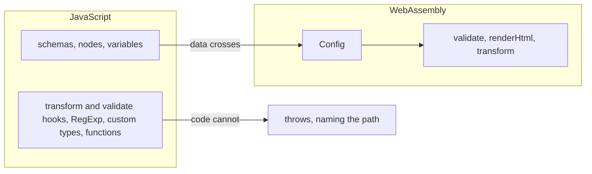

## Install

```sh
npm install accent-proust
```

The module is ESM and initialises once, before any other call. The
[playground](/playground) on this site is this package, loaded exactly the way
the browser example below loads it.

## In a browser

`init()` with no argument resolves the `.wasm` beside the JavaScript, so Vite,
a native `<script type="module">` and a CDN all work unchanged.

```js
import init, { validate, renderHtml, transform, format } from "accent-proust";

await init();

const source = "# Title \n";

renderHtml(source); // '<article><h1 id="intro">Title </h1></article>'
validate(source);   // []
format(source);     // '# Title \n'
transform(source);  // the renderable tree, below
```

Pass an explicit location when your bundler does not rewrite the default one:

```js
import init from "accent-proust";
import wasm from "accent-proust/accent_proust_wasm_bg.wasm?url";

await init({ module_or_path: wasm });
```

## In Node

`init()` with no argument **does not work in Node.** The default location is a
`file:` URL and Node's `fetch` rejects those, which surfaces as `TypeError:
fetch failed`. Read the file and hand it over:

```js
import { readFileSync } from "node:fs";
import { fileURLToPath } from "node:url";
import init, { renderHtml } from "accent-proust";

const wasm = fileURLToPath(
  import.meta.resolve("accent-proust/accent_proust_wasm_bg.wasm")
);
await init({ module_or_path: readFileSync(wasm) });

renderHtml("# Title\n"); // '<article><h1>Title</h1></article>'
```

The package ships the browser build only. A `nodejs` build, which would make
`init()` work unaided, is additive and not here yet.

## The four entry points

Each takes the document source and parses from scratch. Nothing is cached
between calls and no value holds a reference into WebAssembly memory, so there
is nothing to free.

### `renderHtml(source): string`

The whole pipeline: parse, transform against the built-in configuration, render.
A document with validation errors still renders, because a preview pane that
blanks on the first mistake is worse than one that shows the mistake.

### `validate(source): ValidateError[]`

Diagnostics, empty when the document is clean.

```js
validate("\n\n");
// [{
//   type: "tag",
//   lines: [0, 1, 1, 2],
//   location: { start: {...}, end: {...} },
//   error: {
//     id: "tag-undefined",
//     level: "critical",
//     message: "Undefined tag: 'callout'"
//   }
// }]
```

`error.id` is Markdoc's own id, unchanged. It is what external tooling binds to.

### `transform(source): RenderableTreeNode[]`

The renderable tree, for a host that owns its own markup. A tag is an object
carrying `$$mdtype: "Tag"`, exactly as `@markdoc/markdoc` produces, so a React
or Vue renderer written against Markdoc maps tag names onto components without
changes:

```js
transform("# Title \n");
// [{ $$mdtype: "Tag", name: "article", attributes: {}, children:
//   [{ $$mdtype: "Tag", name: "h1", attributes: { id: "intro" },
//      children: ["Title "] }] }]
```

Anything that is not a tag is the scalar it renders to; a text node is a plain
string.

### `format(source): string`

Canonical Markdoc source. `format(format(s)) === format(s)`, and a formatted
document parses to the document the original parsed to, so an editor can rewrite
a buffer in place without losing anything.

## Positions are UTF-16 code units

This is the part worth reading even if you skim the rest.

Diagnostic positions are counted in **UTF-16 code units** -- what JavaScript
means by a string index, and what a CodeMirror position, a Monaco position and
an LSP `character` all are. The engine measures UTF-8 bytes internally, and the
conversion happens before the value crosses the boundary:

```js
const { start, end } = validate(source)[0].location;
view.dispatch({ selection: { anchor: start.offset, head: end.offset } });
```

Each edge carries four fields:

| Field | Unit | Note |
|---|---|---|
| `line` | lines | Zero-based |
| `character` | UTF-16 code units | From the start of the line |
| `offset` | UTF-16 code units | From the start of the document, so usable as a string index directly |
| `byteOffset` | UTF-8 bytes | The engine's own unit, for a host that wants to index the source as bytes |

`byteOffset` is the only field that is not code units, and it is named so that it
cannot be mistaken for one. Without this conversion the two units agree until an
author writes a character outside ASCII, at which point an unconverted offset
underlines the wrong character -- a bug that is invisible in every test written
in English.

## Your own tags

The four functions above use Markdoc's built-in configuration, so a tag your
host defines reports `tag-undefined`. Build a `Config` once and call the same
stages on it:

```js
import init, { Config } from "accent-proust";
await init();

const config = new Config({
  tags: {
    callout: {
      render: "Callout",
      attributes: {
        type: { type: "String", default: "note", matches: ["note", "warning"] },
        title: { type: "String", required: true },
      },
    },
  },
  variables: { flags: { beta: true } },
});

config.validate(source);   // knows `callout`, checks its attributes
config.renderHtml(source);
config.transform(source);
```

Declarations merge over the built-ins, so `` and `` keep
working. Construction does the parsing and checking once; the methods then cost
what the free functions cost, which is what an editor revalidating on every
keystroke needs. Call `config.free()` when you are done with it.

`nodes` takes the same shape as `tags`, keyed by Markdoc node type, so you can
change what a `heading` renders as.

### What crosses the boundary



A schema is data and crosses whole: `render`, `children`, `attributes`, `slots`,
`selfClosing`, `inline`, `description`, and on an attribute `type`, `default`,
`required`, `matches`, `render`, `errorLevel`.

Attribute types are written as the strings `"String"`, `"Number"`, `"Boolean"`,
`"Object"`, `"Array"`. Markdoc uses the JavaScript constructors, and a
constructor is a function. An array of them is a union.

### What does not

A hook is code, and code does not cross: `transform`, `validate`, a custom
attribute type, a `RegExp` in `matches`, and host-defined `functions`.

> [!WARNING]
> **The browser is never stricter than your server, only faster.** Keep the server
> as the authority for anything a hook decides; treat what runs here as an early
> warning.

Nothing is dropped in silence. A configuration carrying something that cannot
cross is refused, naming the path to it:

```text
config.tags.callout.attributes.type.type: unknown attribute type "Str";
expected String, Number, Boolean, Object, Array, or an array of those
```

A schema that half arrives is worse than one that does not, because the missing
half is invisible until an author trips over it.

## Not supported yet

**Partials** and **host-defined functions.** A parsed partial borrows its
source, so holding both across the boundary needs a design this does not have.
Both are refused by name rather than ignored.

`parse` is not exposed either: the abstract syntax tree has no JavaScript shape
here yet. `validate` and `transform` cover what a preview pane and a custom
renderer need.

## Differences from `@markdoc/markdoc`

The tag language and the validation error ids are the contract and are
reproduced exactly. CommonMark edge behaviour is not: Markdoc is built on
markdown-it and this is built on pulldown-cmark. Every deliberate difference is
listed under [Divergences](/docs/divergences).

## Size and speed

The package is built at `opt-level = 3` rather than `opt-level = "z"`, which is
a measured choice. On a 72 KB document `renderHtml` takes about 9.2 ms, against
17.9 ms at `"z"` -- and the smaller build saves 44 KB gzipped. A preview pane
pays the download once and the render on every keystroke, so the 44 KB buys back
8.7 ms each time it is spent. If your trade is the other way round, rebuild the
`accent-proust-wasm` crate with `"z"`.
