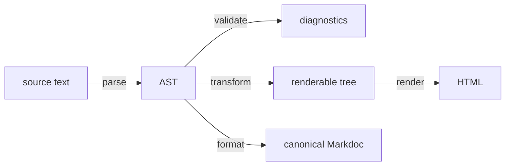

## The pipeline



The AST is the hub, and that is the shape worth noticing: `validate`,
`transform` and `format` each read it independently. `format` takes an AST, not
a renderable tree, so a formatter never runs the middle of the pipeline. And
`validate` produces diagnostics beside the tree rather than gating it -- a
document with errors still transforms and still renders.

Each stage is a pure function of its inputs, and each is a separate entry point.
A linter stops after `validate`. An editor stops after `transform` and maps the
tree onto its own components. A static site generator runs the lot. A formatter
skips the middle entirely and goes from AST straight back to source.

Nothing in the crate holds state between calls, and output is deterministic:
attribute order is authored order, never hash order, so two runs over the same
input produce identical bytes.

## What the crate refuses to do

No I/O. No configuration file. No concept of a file, a theme, a template or a
plugin. Everything host-specific arrives as data the caller passes in, or through
the one trait the caller implements.

<div class="diagram-scroll">

```svgbob
         the host                                  "accent-proust"

  +----------------------+                    +----------------------+
  | a CommonMark         |   impl Tokenizer   |                      |
  | segmenter            +------------------->+  parse               |
  +----------------------+      a trait       |                      |
                                              |                      |
  +----------------------+                    |                      |
  | schemas: a constant, |   build a Config   |                      |
  | YAML, a database,    +------------------->+  validate            |
  | a sandboxed guest    |     plain data     |  transform           |
  +----------------------+                    |                      |
                                              |                      |
  +----------------------+                    |                      |
  | your elements,       |  renderable tree   |                      |
  | your escaping,       +<-------------------+  "render_all is only"|
  | your templates       |   from transform   |  a shortcut          |
  +----------------------+                    +----------------------+
```

</div>

This is not minimalism for its own sake. It is what makes the crate embeddable
in a CMS, a language server and a build tool without any of the three inheriting
the others' assumptions -- and it is enforced by a CI job rather than by
discipline.

### The one trait: `Tokenizer`

`Tokenizer` segments CommonMark. A default implementation over `pulldown-cmark`
ships behind the `pulldown-cmark-tokenizer` feature, which is on by default and
can be turned off:

```toml
accent-proust = { version = "*", default-features = false }
```

A host that already parses CommonMark supplies its own rather than compiling a
second one into the same binary. The seam earns its keep in a specific case: if
you pin `pulldown-cmark` to a git revision, Cargo treats it as a different
package, and you would end up rendering some documents through one copy and some
through the other.

### The two responsibilities left outside

The crate documentation names two more seams. Neither is a trait, and that is
the design rather than an omission.

**Where a schema comes from.** You build a `Config` and hand it over. Whether
the schemas in it came from a constant, a YAML file, a database or a sandboxed
guest is not something a trait could usefully abstract without also deciding how
errors and lifetimes work for all four.

**HTML policy.** `render::render_all` emits upstream's markup and is a
convenience. A host that wants different elements, different escaping or a
template engine walks the renderable tree itself -- a plain tree of tags and
scalars, which is what `transform` returns for exactly this purpose.

## Invariant 1: the library stands alone

`scripts/check-standalone.sh` fails the build if the library's manifest gains a
`path` or `git` dependency, or if a host crate appears anywhere in its tree. A
separate CI job builds and tests the crate with `--no-default-features`, so the
no-tokenizer configuration is supported rather than tolerated.

The release script runs the same check before publishing, because a path
dependency that reaches crates.io is the class of mistake that cannot be undone
once a version is on the index.

## Layout mirrors upstream

The module tree matches upstream file-for-file wherever the code is a pure
function of its inputs, so a future upstream commit diffs cleanly against its
Rust counterpart.

| Upstream | Here |
|---|---|
| `src/ast/` | `src/ast/` |
| `src/grammar/tag.pegjs` | `src/grammar/` |
| `src/parser.ts`, `src/tokenizer/` | `src/parse/` |
| `src/validator.ts`, `src/schema.ts`, `src/schema-types/` | `src/validate/` |
| `src/transformer.ts`, `src/transforms/` | `src/transform/` |
| `src/renderers/html.ts` | `src/render/` |
| `src/formatter.ts` | `src/format/` |
| `src/functions/` | `src/functions/` |
| `src/tags/` | `src/tags/` |

Two upstream trees are vendored at the ported revision and never edited:

| Path | What | Why |
|---|---|---|
| `spec/` | The conformance corpus and its runner | It is the test suite, so a fresh clone runs it with `cargo test` and nothing else |
| `reference/` | Upstream's TypeScript, its unit tests, and its markdown-it patch | A porting pull request shows its source in the same diff, and the yearly upstream refresh is a `git diff` rather than a second checkout |

`reference/` is excluded from the published crate -- 392 KB of another language
is useful in the repository and dead weight in a download. `spec/` is not
excluded: a package that cannot run its own tests is the worse trade.

## The workspace

The library is the workspace root package and stays at the repository root.
Members are hosts:

| Member | What |
|---|---|
| `crates/accent-proust-wasm` | WebAssembly bindings for a browser or other JavaScript host. Ships to npm rather than crates.io, so it sets `publish = false` |

A binding that carries the library across an ABI is a host in the same sense a
CMS is, so it gets a crate beside the library rather than a feature inside it --
the same reasoning that keeps `Tokenizer` a trait rather than an implementation.
`default-members = ["."]` holds a bare `cargo build`, `cargo test` and
`cargo clippy --all-targets` to the library alone, so no member can quietly join
the standalone, MSRV or conformance lanes.

## The two ratchets

Both fail on drift in either direction, and both are the point of the project
rather than bookkeeping.

**Conformance.** `conformance-baseline.txt` records where the corpus counter
stood. `cargo test --test conformance` compares the run against it and fails on
any difference: a drop is a regression and is not mergeable, a rise is a baseline
that was not updated in the same commit. It is deliberately not an absolute
`105/105` gate, which would leave every pull request failing a required check
until the port finished.

```text
conformance: 95 green, 10 annotated, 0 failing (of 105)
```

**Divergences.** A case that should stop being green is a *divergence*, which
means an entry in `DIVERGENCES.md` and a move from `green` to `annotated` -- not
a smaller number in the baseline. That file is normative, not a changelog.

Upstream error ids are the one place where divergence is disallowed outright
rather than declared, because external tooling binds to them.

## Panic-freedom

`unsafe_code` is forbidden and `panic`, `unwrap`, `expect` and `indexing_slicing`
are denied in CI. An `#[allow]` with a comment saying why the bound is proven is
the intended escape hatch; an `#[allow]` without one is the thing being
prevented.

The promise covers values a *caller* builds as well as documents the crate
parses, and it covers every way of touching one. Each public recursive type --
`ast::Node`, `ast::Value`, `renderable::Tag` and `renderable::Scalar` -- writes
out all four of its traversals by hand: `Drop`, `Clone`, `PartialEq` and
`Debug`. A derived implementation of any of them recurses once per level, and a
stack overflow aborts rather than panics, so a caller could otherwise kill the
process with a value it assembled through the public API. `Drop` and `PartialEq`
walk a worklist, `Clone` walks post-order onto a plan and rebuilds bottom-up, and
`Debug` emits from a token stack. None of it is `unsafe`.

Property tests assert the parser never panics on arbitrary input, and fuzzing
precedes publication.
